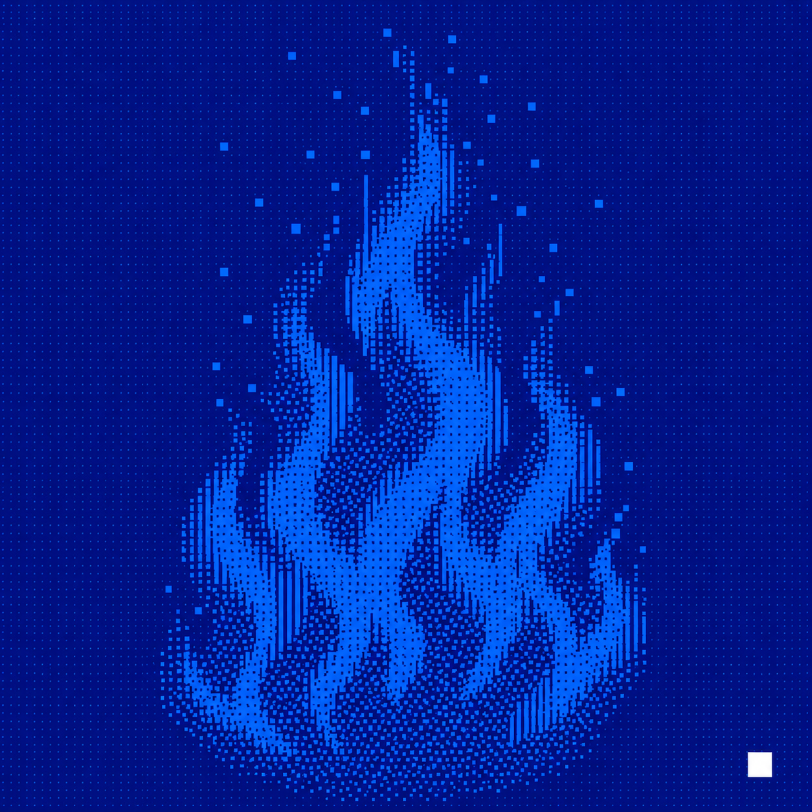

# BURN — Uniswap V4 上的"最后燃烧者通吃"游戏（Base）

<p align="center">
  
</p>

<p align="center">
  <a href="https://x.com/BasedBurnfi">𝕏 @BasedBurnfi</a> ·
  <a href="https://basescan.org/address/0x215c7B9A00403B2a89A766F5D36E1178Dda22895">BURN token</a> ·
  <a href="https://basescan.org/address/0xb1DB810363de384679aAc6b05C23fefAe43823D1">BurnGame</a> ·
  <a href="https://basescan.org/address/0xBB5F858d2bB1abeEa1adf4103DEcEbC2321d0044">BurnGameHook</a>
</p>


Uniswap V4 hook + ERC20 燃烧博弈，部署在 Base 链。

- **Pool**：原生 ETH (currency0=0x0) / BURN (currency1)
- **LP fee**：0.3%（`PoolKey.fee = 3000`）
- **Hook fee**：1%（afterSwap 抽 unspecified 侧）
  - 如果落在 ETH 侧：直接 take 给奖池
  - 如果落在 BURN 侧：hook 在同一笔交易里发起一次 BURN→ETH 反向 swap，把换得的 ETH 注入奖池
- **燃烧规则**：任何人调 `BurnGame.burn()`，把固定 **500,000 BURN（=总供应 0.05%）** 转到黑洞地址 `0x000000000000000000000000000000000000dEaD`（totalSupply 不减少，黑洞余额累积），立即成为当前领先者，10 分钟倒计时重置
- **奖池**：纯 ETH 单币种。倒计时归零后，领先者可拿 80%，剩 20% 滚入下一轮
- **领奖两步走（pull-payment）**：
  1. `settle()` — 倒计时归零后**任何人**可调，把奖金记到 leader 的 `pendingWithdrawals` 账上，roundId++，进入下一轮。**不涉及任何转账**。
  2. `withdrawPrize()` — 中奖者**自己**调，把记账的 ETH 真转到自己钱包。

  为什么拆两步：如果直接转账，赢家是 revert on receive 的恶意合约就能卡死整个游戏。改成"记账+自取"后，恶意赢家只卡住自己钱包，对其他人零影响。

## 合约

| 合约 | 文件 | 作用 |
|---|---|---|
| `BurnToken` | [src/BurnToken.sol](src/BurnToken.sol) | ERC20Burnable，总量 10 亿，部署时全部 mint 给 deployer |
| `BurnGameHook` | [src/BurnGameHook.sol](src/BurnGameHook.sol) | v4 hook，afterSwap 抽 1%（BURN 侧自动换 ETH） |
| `BurnGame` | [src/BurnGame.sol](src/BurnGame.sol) | 奖池（ETH）、倒计时、烧币、结算、80/20 滚动 |

## 安装 & 测试

```bash
forge install foundry-rs/forge-std --shallow
forge install OpenZeppelin/openzeppelin-contracts --shallow
forge install Uniswap/v4-core --shallow
forge build
forge test -vvv     # 13 个测试全过（10 个 game 逻辑 + 3 个 v4 集成）
```

## 部署到 Base

1. 复制 `.env.example` 为 `.env` 并填入 `PRIVATE_KEY`、`BASE_RPC_URL`、`BASE_POOL_MANAGER`。
2. ```bash
   forge script script/Deploy.s.sol:Deploy --rpc-url base --broadcast --verify
   ```
3. 用 PositionManager 初始化 Pool（参数见下文），然后用 1B BURN 单边加流动性。

## Pool 初始化 / LP 参数（2 ETH FDV，1B BURN 总供应）

部署到 Base 后，用 ethers.js / PositionManager 初始化 pool 和加 LP。下面是 **2 ETH FDV 起步、1B BURN 全部单边入池** 的参数计算：

```js
// 同精度 (18 dec) 下，price = currency1/currency0 = BURN/ETH = TOTAL_SUPPLY / FDV
// 用整数 sqrt 精确算 sqrtPriceX96（避免浮点误差）
function sqrtBigInt(n) {
  if (n < 2n) return n;
  let x = n, y = (x + 1n) >> 1n;
  while (y < x) { x = y; y = (x + n / x) >> 1n; }
  return x;
}

const TOTAL_SUPPLY    = 1_000_000_000n;         // 1B BURN
const FDV_ETH         = 2n;                     // 2 ETH 起步 FDV
const PRICE           = TOTAL_SUPPLY / FDV_ETH; // = 5e8 (BURN per ETH)
const Q192            = 1n << 192n;

const INIT_SQRT_PRICE_X96 = sqrtBigInt(PRICE * Q192);
//                       ≈ 1771595571142957102496609794097…  (uint160)

// initialize 后实际 emit 的 tick ≈ 200310，下面参数据此对齐 tickSpacing=200
const TICK_SPACING        = 200;
const TICK_INIT_EXPECTED  = 200310;             // 跑完 initialize 用 Initialize 事件验证
const TICK_UPPER          = 200200;             // < tickInit ⇒ 100% currency1 (BURN) 单边
const TICK_LOWER          = 154400;             // tickUpper - 45800 ≈ 100x 价格区间

const LP_BURN = ethers.parseUnits("1000000000", 18);  // 10 亿 BURN 全进池
const LP_ETH  = 0n;                                   // 单边，无 ETH

const POOL_KEY = {
  currency0: ethers.ZeroAddress,                 // 原生 ETH
  currency1: BURN_ADDRESS,                       // 从部署日志拿
  fee:        3000,                              // 0.3% LP fee
  tickSpacing: TICK_SPACING,
  hooks:      HOOK_ADDRESS,                      // 从部署日志拿
};
```

**校验思路**：
- 初始化 pool 后从 `Initialize` 事件读出 `tick`，应 ≈ 200310（小数点对齐误差几个 tick 没关系）
- 必须满足 `tickUpper < tick` 才能 100% 单边 BURN（PositionManager 否则会要求你也付 ETH）
- LP 范围 `[TICK_LOWER, TICK_UPPER]` 对应 ≈100x 价格区间。买家把价格从初始位置推进 range 时，LP 开始按比例释放 BURN 换 ETH

如果想偷懒用近似值（FDV 漂 ~0.05%）：

```js
const INIT_SQRT_PRICE_X96 = 22360n << 96n;       // 简化版，FDV ≈ 2.0009 ETH
```

## 关键参数表

| 参数 | 值 | 在哪 |
|---|---|---|
| 总供应 | 1,000,000,000 BURN | `Deploy.s.sol` |
| 每次烧的固定数量 | 500,000 BURN (= 0.05% of supply) | `BurnGame.BURN_AMOUNT` |
| 倒计时 | 10 分钟 | `BurnGame.ROUND_DURATION` |
| 赢家分成 | 80% | `BurnGame.WINNER_SHARE_BPS` |
| LP fee | 0.3% (= 3000 pips) | PoolKey 初始化时设置 |
| Hook fee | 1% (从 unspecified 侧) | `BurnGameHook.HOOK_FEE_BPS` |
| tickSpacing | 200 | PoolKey |
| 奖池币种 | 原生 ETH | `BurnGame.rewardCurrency` |

## 玩法 / 函数速查

| 调用者 | 函数 | 作用 |
|---|---|---|
| 玩家 | `BurnGame.burn()` | 烧 500k BURN 到 dEaD，成为 leader，10 分钟倒计时重置 |
| **任何人** | `BurnGame.settle()` | 倒计时归零后调，把奖金记账给 leader（**不转账**），roundId++ |
| **赢家自己** | `BurnGame.withdrawPrize()` | 把记账的 ETH 实际转到自己钱包 |
| 任何人 | `BurnGameHook.flush()` | 把 hook 内偶发残留 BURN 打 dEaD、残留 ETH 转给奖池 |

#### 一个完整回合的流程

```
1. trader 们 swap                  → hook 每笔抽 1% → 奖池累计 ETH
2. 玩家 A 先 approve(game, 500k BURN)
3. 玩家 A 调 burn()                → A 成为 leader, 倒计时 10:00
4. 5 分钟后玩家 B 调 burn()        → B 成为 leader, 倒计时重置 10:00
5. 10 分钟内没人接力               → B 锁定胜利
6. 任何人调 settle()               → 80% 记到 pendingWithdrawals[B], 20% 滚下一轮, roundId→1
7. B 自己调 withdrawPrize()        → ETH 到 B 钱包

   (如果在 5 之前/同时有人调 burn 起新一轮，settle 会被自动触发；省了第 6 步手动调用)
```

#### 关键问题答疑

- **为什么 settle 和 withdrawPrize 要分开？** 防恶意赢家。直接转账可被合约通过 revert on receive 卡死整个游戏；记账后自取就只有恶意合约自己亏。
- **settle 谁来调？** 任何人都行。一般是 leader 或下一个想 burn 的人帮调（顺手帮社区翻页）。如果都不调，下一个 `burn()` 的开始会自动结算。
- **赢家多次中奖怎么办？** `pendingWithdrawals[winner]` 是累加的，可以多轮中奖后一次性 `withdrawPrize()` 全取走。
- **错过领奖会过期吗？** 不会，pending 永久有效。但建议早提避免合约升级类风险。

## 测试覆盖

```
test/BurnGame.t.sol         10 个游戏逻辑测试（含 ETH 原生 payout 验证）
test/BurnGameHook.t.sol     3 个端到端 v4 swap 测试：
   - ETH 侧 fee 直接进池
   - BURN 侧 fee 触发 hook 内嵌 swap 换 ETH 进池
   - 双向 swap 累积测试
```

## 前端 / 网站

[website/](website/) 是已经对接好实时数据 + 钱包连接的单页 dapp。

```
website/
├── index.html         # 已有的设计 + 注入的实时数据元素 ID
├── app.js             # Web3 模块（ethers v6 from esm.sh）
├── assets/            # 背景图
├── uploads/           # 你自己的上传素材
└── tweaks-panel.jsx   # 设计调节面板（保留）
```

### 部署后接合约的 3 步

1. **改 [website/app.js](website/app.js) 顶部 CONFIG**：

   ```js
   BURN_TOKEN: '0x…',   // 部署日志里的 BurnToken
   BURN_GAME:  '0x…',   // 部署日志里的 BurnGame
   BURN_HOOK:  '0x…',   // 部署日志里的 BurnGameHook
   ```

2. **本地起服务跑起来**（ES module 不能直接 file://）：

   ```bash
   cd website
   python -m http.server 8080
   # 或：npx serve .
   ```
   打开 http://localhost:8080

3. **上线**：把 `website/` 目录扔到任意静态托管（Vercel / Netlify / Cloudflare Pages / IPFS）。无构建步骤，纯静态 HTML + ESM。

### 网页都对接了什么

| 元素 | 来源 |
|---|---|
| 倒计时 (`mm:ss`) | `BurnGame.endTime()` − `block.timestamp` |
| Prize pool | `BurnGame.prizePool()` |
| Current leader | `BurnGame.currentLeader()` |
| Round id | `BurnGame.roundId()` |
| Total burned at 0xdEaD | `BurnToken.balanceOf(0xdEaD)` |
| Nav block number | `provider.getBlockNumber()` |
| 你的 BURN 余额 / allowance | `BurnToken.balanceOf(you)` / `allowance(you, game)` |
| 你的待领奖金 | `BurnGame.pendingWithdrawals(you)` |
| **Burn 按钮** | `approve()` (若不够) → `burn()` 两笔 |
| **Settle 按钮**（仅当倒计时归零时浮现） | `BurnGame.settle()` |
| **Withdraw 按钮**（仅当你 pending > 0 时浮现） | `BurnGame.withdrawPrize()` |
| **Flush 按钮**（hook 残值清理） | `BurnGameHook.flush()` |

### 钱包支持

modal 里 4 个 logo（取自 `wallets/`）：MetaMask、OKX、Binance、TokenPocket。会自动检测扩展是否安装，没装就跳官网下载。连上后自动尝试切到 Base 主网（chain id 8453），没有则提示添加。

### 合约未部署时表现

`CONFIG` 里地址还是 `0x0…0` 时：
- 黄色 banner 顶部提示 "Pre-launch · contract addresses pending"
- 倒计时跑 demo 循环（10 分钟假数据）
- 其它 stat 显示 "—" / "pre-launch"
- 钱包还是可以连，连完也只能拍照纪念

填上地址刷新页面后整站立即变成实时数据驱动。

## 安全性 / 限制

- **池子白名单**（C-1 修复）：Hook 在 `afterSwap` 第一行校验 `currency0==ETH && currency1==BURN`，其它池子的 swap 静默跳过 fee，防止攻击者用同 hook 起恶意池污染奖池
- **Pull-payment 派奖**（C-2 修复）：`settle()` 只记账不转账，赢家自调 `withdrawPrize()`，恶意赢家 revert on receive 只能卡住自己
- **Partial-fill 安全**（H-1 修复）：BURN→ETH 转换 swap 按 `swapDelta` 实际消耗量结算，深度边界条件下不会卡 unlock
- **Flush 出口**（H-2 修复）：`flush()` 公开可调，hook 内偶发残留 BURN→dEaD、ETH→奖池，无管理员
- **余额对账**（M-1 修复）：`notifyFee` 校验 `actual_balance ≥ prizePool + totalPending + amount` 防虚增计数
- **奖池资金安全**：无 admin / owner 撤资路径，资金只能通过 `withdrawPrize` 流出
- **重入**：`_settleRound()` 状态先清再外部调用 + pull-payment，无利可图的重入面
- **Hook 二次 swap**：`_inConversion` 标志位防递归，内部 swap 内 skip fee
- **气价**：BURN 侧 swap 多 ~50k gas（内嵌兑换），ETH 侧 ~10k gas 额外开销
